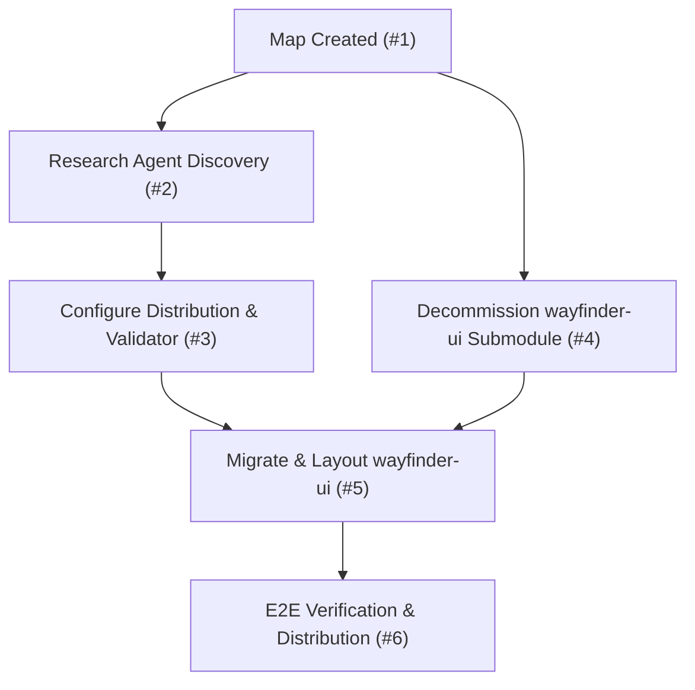

# Agent Skills Repository Architecture & Decision Record

## Destination & Purpose

Repurposed this repository (`cachemoney/agent-skills`) into a dedicated **Agent Skills catalog and multi-agent distribution hub** following the [Agent Skills specification](https://agentskills.io/specification), with [`wayfinder-ui`](file:///home/mezmo/Work/vibe/agent-skills/skills/wayfinder-ui) converted and verified as the inaugural skill.

---

## Architecture Decisions Locked

### 1. Repository Role: Skills Catalog & Distribution Hub
- **Decision**: Retain workspace distribution and pre-commit automation ([`ai-workspace.toml`](file:///home/mezmo/Work/vibe/agent-skills/ai-workspace.toml), [`.ai-workspace/scripts/transpile-skills.py`](file:///home/mezmo/Work/vibe/agent-skills/.ai-workspace/scripts/transpile-skills.py)), but pivot the repository away from an open-ended multi-repo submodule template to a focused library of first-party agent skills located under [`skills/<skill-name>/`](file:///home/mezmo/Work/vibe/agent-skills/skills).
- **Trade-off**: Maintains pre-configured multi-tool symlinking (.claude, .cursor, .gemini, .opencode) without maintaining external submodule indirection for skills.

### 2. Multi-Agent Distribution Strategy
Based on primary research recorded in [`docs/research/skill-discovery-paths.md`](file:///home/mezmo/Work/vibe/agent-skills/docs/research/skill-discovery-paths.md):
- **`.agents/skills/`**: Universal target serving Google Antigravity / Gemini CLI, Cursor (which natively discovers `.agents/skills/`, avoiding symlink indexer bugs), and OpenCode fallback.
- **`.claude/skills/`**: Dedicated target for Anthropic Claude Code (which exclusively discovers `.claude/skills/`).
- **`.opencode/skill/`**: Dedicated target for OpenCode legacy and standard layout.

### 3. Polyglot Skill Compatibility
- **Decision**: Skills may use zero-dependency Node.js scripts or Python (`uv run` / PEP 723 inline metadata).
- **Specification Compliance**: Runtimes are explicitly declared in `SKILL.md` frontmatter via `compatibility` (e.g., `compatibility: Requires Node.js >= 18`).
- **Validator Support**: [`.ai-workspace/scripts/transpile-skills.py`](file:///home/mezmo/Work/vibe/agent-skills/.ai-workspace/scripts/transpile-skills.py) validates optional spec fields (`compatibility`, `license`, `metadata`, `allowed-tools`), requiring string-to-string mappings in `metadata` for strict OpenCode Go parser compatibility.

### 4. Inaugural Skill: `wayfinder-ui`
- **Submodule Decommissioned**: [`repositories/wayfinder-ui`](file:///home/mezmo/Work/vibe/agent-skills/repositories/wayfinder-ui) unlinked from `.gitmodules` and git index; source files safely migrated to first-party ownership.
- **Progressive Disclosure Layout**:
  - `skills/wayfinder-ui/SKILL.md` (188 lines, metadata frontmatter, operational procedures)
  - `skills/wayfinder-ui/scripts/server.mjs` (Node.js runtime server)
  - `skills/wayfinder-ui/assets/page.html` (interactive web UI dashboard)
  - `skills/wayfinder-ui/references/` (`visual-brief.md`, `design.md`)
  - `skills/wayfinder-ui/test/` (`server.test.mjs`, `page.e2e.mjs`)

---

## Execution Graph & Verification Summary

| Issue | Title | Type | Status |
|---|---|---|---|
| [#2](https://github.com/cachemoney/agent-skills/issues/2) | Research skill discovery paths across agent CLIs | Research | Resolved |
| [#3](https://github.com/cachemoney/agent-skills/issues/3) | Configure multi-agent skill distribution paths & spec validation | Task | Resolved |
| [#4](https://github.com/cachemoney/agent-skills/issues/4) | Decommission wayfinder-ui git submodule and clean repository references | Task | Resolved |
| [#5](https://github.com/cachemoney/agent-skills/issues/5) | Migrate and restructure wayfinder-ui into skills/wayfinder-ui | Task | Resolved |
| [#6](https://github.com/cachemoney/agent-skills/issues/6) | End-to-end verification and distribution of wayfinder-ui skill | Task | Resolved |

### Automated Test Results
- **Node Unit Tests**: `node skills/wayfinder-ui/test/server.test.mjs` $\rightarrow$ **15/15 passed** (5.6s).
- **Python Validator Tests**: `uv run pytest tests/` $\rightarrow$ **7/7 passed** (0.17s).
- **Workspace Alignment**: `uv run .ai-workspace/scripts/align-workspace.py --check` $\rightarrow$ **Passed**.
- **Pre-commit Suite**: `uv run pre-commit run --all-files` $\rightarrow$ **Passed**.
- **Symlink Distribution**:
  - `.agents/skills/wayfinder-ui` $\rightarrow$ `../../skills/wayfinder-ui`
  - `.claude/skills/wayfinder-ui` $\rightarrow$ `../../skills/wayfinder-ui`
  - `.opencode/skill/wayfinder-ui` $\rightarrow$ `../../skills/wayfinder-ui`

---

## Out of Scope & Future Efforts
- `repositories/grill-with-ui` remains a submodule for a future conversion effort using this template.
- External vendor skills locked in `.agents/skills/` remain untouched.
