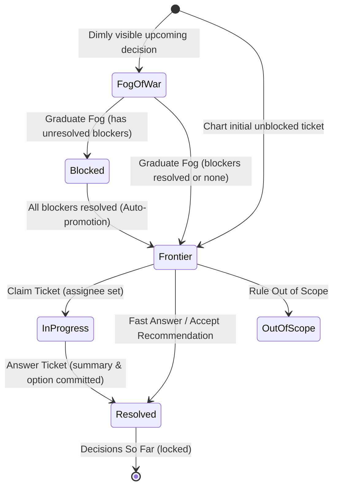

# Research Report: Comprehensive Functional & Visual Parity Investigation: `skills/wayfinder-ui` vs. `wayfinder` (`.agents/skills/wayfinder`)

**Date:** 2026-09-24  
**Author:** AI Research Subagent  
**Investigation Target:** [`skills/wayfinder-ui`](file:///Users/cache/Development/Vibe/agent-skills/skills/wayfinder-ui)  
**Baseline Standard:** [`wayfinder`](file:///Users/cache/Development/Vibe/agent-skills/.agents/skills/wayfinder/SKILL.md)  
**Supporting Primary Sources:**
- Specification: [`docs/wayfinder-ui-spec.md`](file:///Users/cache/Development/Vibe/agent-skills/docs/wayfinder-ui-spec.md)
- Architectural Decision Record: [`docs/adr/0001-wayfinder-ui-client-persistence-and-pending-reconciliation.md`](file:///Users/cache/Development/Vibe/agent-skills/docs/adr/0001-wayfinder-ui-client-persistence-and-pending-reconciliation.md)
- UI Daemon: [`skills/wayfinder-ui/scripts/server.mjs`](file:///Users/cache/Development/Vibe/agent-skills/skills/wayfinder-ui/scripts/server.mjs)
- Browser Frontend: [`skills/wayfinder-ui/assets/page.html`](file:///Users/cache/Development/Vibe/agent-skills/skills/wayfinder-ui/assets/page.html)
- Daemon & Engine Tests: [`skills/wayfinder-ui/test/server.test.mjs`](file:///Users/cache/Development/Vibe/agent-skills/skills/wayfinder-ui/test/server.test.mjs)
- Browser Test Suites: [`skills/wayfinder-ui/test/page.e2e.mjs`](file:///Users/cache/Development/Vibe/agent-skills/skills/wayfinder-ui/test/page.e2e.mjs), [`skills/wayfinder-ui/test/page.spec.mjs`](file:///Users/cache/Development/Vibe/agent-skills/skills/wayfinder-ui/test/page.spec.mjs)
- Reference Briefs: [`skills/wayfinder-ui/references/visual-brief.md`](file:///Users/cache/Development/Vibe/agent-skills/skills/wayfinder-ui/references/visual-brief.md), [`skills/wayfinder-ui/references/design.md`](file:///Users/cache/Development/Vibe/agent-skills/skills/wayfinder-ui/references/design.md)
- Issue Tracker Conventions: [`docs/agents/issue-tracker.md`](file:///Users/cache/Development/Vibe/agent-skills/docs/agents/issue-tracker.md)

---

## Executive Summary

The user posed the following inquiry regarding [`skills/wayfinder-ui`](file:///Users/cache/Development/Vibe/agent-skills/skills/wayfinder-ui):
> *"I want to make sure the wayfinder-ui skill, `@[skills/wayfinder-ui]`, does everything that the `@[.agents/skills/wayfinder/SKILL.md]` does. I want to take advantage of the html pages that served, and want to be able to html components of the map and related tickets visualized, and have the server update the state of each of the tickets visually"*

This research report provides a rigorous, line-by-line verification of `skills/wayfinder-ui` against `.agents/skills/wayfinder/SKILL.md`.

### Core Verdict
1. **Parity on Core Engine & Mechanics:** **Yes.** `wayfinder-ui` faithfully implements the core mechanics of `wayfinder`: Destination-driven planning ("Plan, don't do"), heterogeneous decision ticket types (`grilling`, `research`, `prototype`, `task`), dependency-based unblocking criteria (`blocked_by` $\rightarrow$ `blocks`), automatic frontier calculation, fog of war, and out-of-scope bounding.
2. **Taking Advantage of Served HTML Pages:** **Yes, substantially enhanced.** Rather than losing graph context in a CLI terminal stream or manually wiring issues on a remote tracker, `wayfinder-ui` serves an interactive local-first browser web app via an ultra-lightweight Node.js daemon ([`server.mjs`](file:///Users/cache/Development/Vibe/agent-skills/skills/wayfinder-ui/scripts/server.mjs)). The frontend ([`page.html`](file:///Users/cache/Development/Vibe/agent-skills/skills/wayfinder-ui/assets/page.html)) provides a full 3-column interactive workspace with topological DAG visualization, decision cards, interactive options selection, ticket-scoped discussion threads, staging tray with batch dispatch (⌘↩), persistent client state, and sandboxed iframe visual prototyping.
3. **Visual Representation of Map & Tickets:** **Yes, with 3 specific UI presentation gaps.** The map's topology is visually rendered as an SVG Directed Acyclic Graph (DAG) with rank leveling, curved bezier connector paths, directional arrowheads, and color-coded status states (glowing amber for frontier, green for resolved, grey for blocked). However, **(a)** resolved ticket cards currently do not display the locked answer summary, **(b)** fog of war items are rendered only in the sidebar rather than on the DAG canvas itself, and **(c)** map notes are omitted from the page header/nav.
4. **Real-Time Visual State Updates from the Server:** **Yes.** The server daemon automatically recomputes reverse dependency edges and promotes blocked tickets to the frontier as soon as blockers resolve. The browser polls `/state` every 1,000 ms; DOM updates occur reactively without full page reloads, transitioning node borders from grey to amber, advancing tickets in the left navigation, and shifting the agent status indicator.

---

## 1. Trace & Evaluation of Original `wayfinder` Capabilities

Every fundamental concept and operational rule from [`.agents/skills/wayfinder/SKILL.md`](file:///Users/cache/Development/Vibe/agent-skills/.agents/skills/wayfinder/SKILL.md) was traced into `skills/wayfinder-ui`.

```
┌─────────────────────────────────────────────────────────────────────────────┐
│                 WAYFINDER CONCEPTUAL MAPPING & PARITY                       │
├───────────────────────────────┬─────────────────────────────────────────────┤
│ Original `wayfinder`          │ `wayfinder-ui` Implementation               │
├───────────────────────────────┼─────────────────────────────────────────────┤
│ Plan, don't do                │ Decisions over deliverables; Finish doc     │
│ Refer by name (titles)        │ Titles on cards, DAG nodes, & Left Nav      │
│ Map as index, ticket as store │ state.json unified + external research/docs │
│ Destination & Notes           │ state.destination, state.notes, state.doc   │
│ Decisions so far              │ status: "resolved", answer: {...}           │
│ Not yet specified (Fog)       │ state.fog: [{ id, title, notes }]           │
│ Out of scope                  │ state.out_of_scope: [{ id, title, why }]    │
│ Ticket types (G, R, P, T)     │ grilling, research, prototype, task         │
│ HITL vs AFK execution         │ Live card/thread vs background subagents    │
│ Native blocking & Frontier    │ blocked_by / blocks + DAG cycle detection   │
│ Claiming                      │ assignee: "@agent" / "@me"                  │
│ Invocation (Chart vs Work)    │ /wayfinder-ui <dest> vs /wayfinder-ui resume│
└───────────────────────────────┴─────────────────────────────────────────────┘
```

### 1.1 Purpose & Philosophy

#### "Plan, don't do"
- **Original `wayfinder` ([`SKILL.md:11-14`](file:///Users/cache/Development/Vibe/agent-skills/.agents/skills/wayfinder/SKILL.md#L11-L14)):** Planning by default; each ticket resolves a decision rather than executing code slices. The effort produces decisions, not deliverables.
- **`wayfinder-ui` ([`SKILL.md:3`](file:///Users/cache/Development/Vibe/agent-skills/skills/wayfinder-ui/SKILL.md#L3), [`docs/wayfinder-ui-spec.md:386-389`](file:///Users/cache/Development/Vibe/agent-skills/docs/wayfinder-ui-spec.md#L386-L389), [`references/design.md:7`](file:///Users/cache/Development/Vibe/agent-skills/skills/wayfinder-ui/references/design.md#L7)):** Strict preservation of the planning philosophy. Trade-off 4 in the spec explicitly mandates "Decisions Over Deliverables: tickets resolve architectural and design questions, not code implementations." The final outcome is a comprehensive Roadmap & Decision Record (`docs/<destination>-roadmap.md`), locking decisions before implementation begins.

#### "Refer by name"
- **Original `wayfinder` ([`SKILL.md:15-18`](file:///Users/cache/Development/Vibe/agent-skills/.agents/skills/wayfinder/SKILL.md#L15-L18)):** Every ticket must be referred to by its human-readable title, never by a bare ID (`#42`), though IDs wrap links.
- **`wayfinder-ui` ([`assets/page.html:701-729, 960-1008`](file:///Users/cache/Development/Vibe/agent-skills/skills/wayfinder-ui/assets/page.html#L701-L729)):** 
  - Left navigation items display full titles with type badges ([`page.html:704`](file:///Users/cache/Development/Vibe/agent-skills/skills/wayfinder-ui/assets/page.html#L704)).
  - SVG DAG nodes display ticket titles alongside ID pills ([`page.html:1003-1004`](file:///Users/cache/Development/Vibe/agent-skills/skills/wayfinder-ui/assets/page.html#L1003-L1004)).
  - Ticket cards present titles as prominent `<h2>` headers ([`page.html:745`](file:///Users/cache/Development/Vibe/agent-skills/skills/wayfinder-ui/assets/page.html#L745)).
  - CLI logs use formatted summaries ([`SKILL.md:126`](file:///Users/cache/Development/Vibe/agent-skills/skills/wayfinder-ui/SKILL.md#L126)).

#### "Index vs. Store"
- **Original `wayfinder` ([`SKILL.md:21-25`](file:///Users/cache/Development/Vibe/agent-skills/.agents/skills/wayfinder/SKILL.md#L21-L25)):** The map issue is an index listing gists and linking child issues; decisions live exclusively in tickets.
- **`wayfinder-ui` ([`scripts/server.mjs:112-126`](file:///Users/cache/Development/Vibe/agent-skills/skills/wayfinder-ui/scripts/server.mjs#L112-L126), [`docs/wayfinder-ui-spec.md:98-112`](file:///Users/cache/Development/Vibe/agent-skills/docs/wayfinder-ui-spec.md#L98-L112)):** 
  - For local execution, `state.json` maintains the ticket graph in a structured aggregate.
  - However, for heavy exploratory assets (subagent research papers, architecture prototypes), `wayfinder-ui` separates storage into external files: `<session>/research/<ticket-id>.md` ([`SKILL.md:136`](file:///Users/cache/Development/Vibe/agent-skills/skills/wayfinder-ui/SKILL.md#L136)) and `<session>/visual.html` ([`server.mjs:251-255`](file:///Users/cache/Development/Vibe/agent-skills/skills/wayfinder-ui/scripts/server.mjs#L251-L255)).
  - Decisions are locked in `ticket.answer` and indexed under Decisions So Far ([`page.html:710`](file:///Users/cache/Development/Vibe/agent-skills/skills/wayfinder-ui/assets/page.html#L710)).

---

### 1.2 Map Structure

| Map Component | Original `wayfinder` Spec | `wayfinder-ui` Implementation | Parity Status |
| :--- | :--- | :--- | :--- |
| **Destination** | 1-2 lines in map body; every session orients to it ([`SKILL.md:32-35`](file:///Users/cache/Development/Vibe/agent-skills/.agents/skills/wayfinder/SKILL.md#L32-L35)) | Top-level string in `state.destination` ([`server.mjs:113`](file:///Users/cache/Development/Vibe/agent-skills/skills/wayfinder-ui/scripts/server.mjs#L113)); persistent header in `#dest-display` ([`page.html:229`](file:///Users/cache/Development/Vibe/agent-skills/skills/wayfinder-ui/assets/page.html#L229)); Finish modal summary ([`page.html:411`](file:///Users/cache/Development/Vibe/agent-skills/skills/wayfinder-ui/assets/page.html#L411)) | **Full Parity** |
| **Notes** | Domain context, skills to consult, standing preferences ([`SKILL.md:36-39`](file:///Users/cache/Development/Vibe/agent-skills/.agents/skills/wayfinder/SKILL.md#L36-L39)) | Stored in `state.notes` via `new --notes` ([`server.mjs:107, 114`](file:///Users/cache/Development/Vibe/agent-skills/skills/wayfinder-ui/scripts/server.mjs#L107-L114)). **Omitted from `page.html` UI!** | **Data Parity; UI Presentation Gap** |
| **Decisions So Far** | One line per closed ticket with gist + link ([`SKILL.md:40-45`](file:///Users/cache/Development/Vibe/agent-skills/.agents/skills/wayfinder/SKILL.md#L40-L45)) | Tickets with `status: "resolved"` indexed in Left Nav ([`page.html:269-271, 710`](file:///Users/cache/Development/Vibe/agent-skills/skills/wayfinder-ui/assets/page.html#L269-L271)); green node on DAG ([`page.html:997-1005`](file:///Users/cache/Development/Vibe/agent-skills/skills/wayfinder-ui/assets/page.html#L997-L1005)). **Answer text omitted on card** | **Engine Parity; Card Display Gap** |
| **Fog of War** | In-scope fog you can't ticket yet; graduates into tickets ([`SKILL.md:46-49, 82-94`](file:///Users/cache/Development/Vibe/agent-skills/.agents/skills/wayfinder/SKILL.md#L46-L49)) | `state.fog` list ([`server.mjs:122, 481-496`](file:///Users/cache/Development/Vibe/agent-skills/skills/wayfinder-ui/scripts/server.mjs#L481-L496)); rendered in Nav ([`page.html:712-719`](file:///Users/cache/Development/Vibe/agent-skills/skills/wayfinder-ui/assets/page.html#L712-L719)); interactive graduation form ([`page.html:308-347`](file:///Users/cache/Development/Vibe/agent-skills/skills/wayfinder-ui/assets/page.html#L308-L347)). **Not drawn on SVG DAG** | **Full Functional Parity; DAG Visual Omission** |
| **Out of Scope** | Ruled beyond destination; closed, never graduates ([`SKILL.md:50-53, 95-102`](file:///Users/cache/Development/Vibe/agent-skills/.agents/skills/wayfinder/SKILL.md#L50-L53)) | `state.out_of_scope` list ([`server.mjs:123`](file:///Users/cache/Development/Vibe/agent-skills/skills/wayfinder-ui/scripts/server.mjs#L123)); staged via "Rule Out of Scope" button ([`page.html:775`](file:///Users/cache/Development/Vibe/agent-skills/skills/wayfinder-ui/assets/page.html#L775)); rendered in Left Nav drawer ([`page.html:720-733`](file:///Users/cache/Development/Vibe/agent-skills/skills/wayfinder-ui/assets/page.html#L720-L733)) | **Full Parity** |

---

### 1.3 Ticket Types & Execution (HITL vs. AFK)

`wayfinder-ui` strictly validates and implements all four ticket types ([`server.mjs:377`](file:///Users/cache/Development/Vibe/agent-skills/skills/wayfinder-ui/scripts/server.mjs#L377)):

1. **Research (`research` - AFK):**
   - *Original Wayfinder ([`SKILL.md:77`](file:///Users/cache/Development/Vibe/agent-skills/.agents/skills/wayfinder/SKILL.md#L77)):* Delegated to autonomous subagents running the "research" skill; results committed to a research branch.
   - *`wayfinder-ui` ([`SKILL.md:133-137`](file:///Users/cache/Development/Vibe/agent-skills/skills/wayfinder-ui/SKILL.md#L133-L137), [`page.html:774`](file:///Users/cache/Development/Vibe/agent-skills/skills/wayfinder-ui/assets/page.html#L774)):* Blue badge (`#2b6cb0`). The card exposes a "Trigger Research" button that stages `{ type: "trigger_research", ticket_id }`. The orchestrator spins up a background research subagent that saves findings to `<session>/research/<ticket-id>.md`, then patches the ticket with `status: "resolved"` and `answer.asset_url`.
2. **Prototype (`prototype` - HITL):**
   - *Original Wayfinder ([`SKILL.md:78`](file:///Users/cache/Development/Vibe/agent-skills/.agents/skills/wayfinder/SKILL.md#L78)):* Creates cheap, rough, concrete artifacts to react to.
   - *`wayfinder-ui` ([`SKILL.md:139-144`](file:///Users/cache/Development/Vibe/agent-skills/skills/wayfinder-ui/SKILL.md#L139-L144), [`page.html:350-375`](file:///Users/cache/Development/Vibe/agent-skills/skills/wayfinder-ui/assets/page.html#L350-L375)):* Purple badge (`#743cb0`). Enhanced with a dedicated **Visual Prototype** viewport displaying subagent-rendered prototypes in a sandboxed `<iframe>` (`/visual`).
3. **Grilling (`grilling` - HITL):**
   - *Original Wayfinder ([`SKILL.md:79`](file:///Users/cache/Development/Vibe/agent-skills/.agents/skills/wayfinder/SKILL.md#L79)):* Conversational interview to pin down architectural forks.
   - *`wayfinder-ui` ([`page.html:283-305, 379-389`](file:///Users/cache/Development/Vibe/agent-skills/skills/wayfinder-ui/assets/page.html#L283-L305)):* Burnt-orange badge (`#b05a2b`). Interactive decision cards with structured options (`A`, `B`, `C`), recommendation trade-off box, and live conversational chat in the right column thread.
4. **Task (`task` - HITL or AFK):**
   - *Original Wayfinder ([`SKILL.md:80`](file:///Users/cache/Development/Vibe/agent-skills/.agents/skills/wayfinder/SKILL.md#L80)):* Manual or deterministic prerequisite work unblocking a decision.
   - *`wayfinder-ui` ([`page.html:14, 82`](file:///Users/cache/Development/Vibe/agent-skills/skills/wayfinder-ui/assets/page.html#L14)):* Green badge (`#2d8a6e`). Staged and resolved through standard lifecycle commands.

---

### 1.4 Ticket Dependencies, Unblocking Criteria & Frontier Calculation

The definition of the frontier in both skills is identical: **the open, unblocked tickets whose prerequisites are all resolved.**

In original `wayfinder` ([`SKILL.md:69-70`](file:///Users/cache/Development/Vibe/agent-skills/.agents/skills/wayfinder/SKILL.md#L69-L70)), blocking edges rely on tracker native relationships (`gh api ... dependencies/blocked_by`).

In `wayfinder-ui`, this is executed via an in-memory graph validation engine in [`server.mjs`](file:///Users/cache/Development/Vibe/agent-skills/skills/wayfinder-ui/scripts/server.mjs):
1. **Reverse Edge Propagation ([`server.mjs:453-464`](file:///Users/cache/Development/Vibe/agent-skills/skills/wayfinder-ui/scripts/server.mjs#L453-L464)):**
   Whenever ticket $T$ specifies `blocked_by: ["B1"]`, `server.mjs` automatically updates $B_1$'s `blocks` array to include $T$.
2. **Topological Frontier Promotion ([`server.mjs:466-476`](file:///Users/cache/Development/Vibe/agent-skills/skills/wayfinder-ui/scripts/server.mjs#L466-L476)):**
   ```javascript
   for (const t of ts) {
     if (t.status === "frontier" || t.status === "blocked") {
       const blockers = Array.isArray(t.blocked_by) ? t.blocked_by : [];
       const allResolved = blockers.every((bid) => {
         const b = ts.find((x) => x && x.id === bid);
         return b && b.status === "resolved";
       });
       t.status = allResolved ? "frontier" : "blocked";
     }
   }
   ```
3. **Cycle Detection ([`server.mjs:526-554`](file:///Users/cache/Development/Vibe/agent-skills/skills/wayfinder-ui/scripts/server.mjs#L526-L554)):**
   Runs a depth-first search (`hasCycle`) with recursion stack tracking (`recStack`). If a cycle is detected (e.g. $A \rightarrow B \rightarrow A$), the patch is rejected atomically, preventing corrupt states. Verified in test suite ([`test/server.test.mjs:335-344`](file:///Users/cache/Development/Vibe/agent-skills/skills/wayfinder-ui/test/server.test.mjs#L335-L344)).

---

### 1.5 Ticket Lifecycle Parity



1. **Claiming:**
   - *`wayfinder`:* Session assigns ticket to self via tracker (`--add-assignee @me`).
   - *`wayfinder-ui`:* User clicks "Claim Ticket" ([`page.html:773`](file:///Users/cache/Development/Vibe/agent-skills/skills/wayfinder-ui/assets/page.html#L773)), staging `{ type: "claim_ticket", ticket_id }`. Agent patches `assignee` ([`SKILL.md:116`](file:///Users/cache/Development/Vibe/agent-skills/skills/wayfinder-ui/SKILL.md#L116)).
2. **Answering & Resolving:**
   - *`wayfinder`:* Resolution comment posted, issue closed, appended to Decisions So Far.
   - *`wayfinder-ui`:* User selects an option or enters custom text, staging `{ type: "answer_ticket", ticket_id, kind, option, text }` ([`page.html:844-857`](file:///Users/cache/Development/Vibe/agent-skills/skills/wayfinder-ui/assets/page.html#L844-L857)). Agent commits patch with `status: "resolved"` and `answer: { summary, option, text }` ([`SKILL.md:117`](file:///Users/cache/Development/Vibe/agent-skills/skills/wayfinder-ui/SKILL.md#L117)). Downstream blocked tickets promote automatically.
3. **Graduating Fog:**
   - *`wayfinder`:* Decisions clear fog ahead; agent writes fresh tickets and deletes them from Not yet specified.
   - *`wayfinder-ui`:* Interactive UI flow: Clicking "Graduate" on a fog item opens the graduation card ([`page.html:308-347, 576-600`](file:///Users/cache/Development/Vibe/agent-skills/skills/wayfinder-ui/assets/page.html#L308-L347)), allowing the human or agent to set ticket ID, title, type, prerequisite blockers, and core question.
4. **Ruling Out of Scope:**
   - *`wayfinder`:* Close issue, record one-line gist and reason in Out of scope section.
   - *`wayfinder-ui`:* "Rule Out of Scope" button on card stages `{ type: "rule_out_of_scope", ticket_id }` ([`page.html:775`](file:///Users/cache/Development/Vibe/agent-skills/skills/wayfinder-ui/assets/page.html#L775)). Agent moves item to `state.out_of_scope` ([`SKILL.md:120`](file:///Users/cache/Development/Vibe/agent-skills/skills/wayfinder-ui/SKILL.md#L120)), which dynamically reveals the Out of Scope section in the Left Nav ([`page.html:720-733`](file:///Users/cache/Development/Vibe/agent-skills/skills/wayfinder-ui/assets/page.html#L720-L733)).

---

### 1.6 Invocation Modes

- **Chart the Map:**
  - *`wayfinder` ([`SKILL.md:107-117`](file:///Users/cache/Development/Vibe/agent-skills/.agents/skills/wayfinder/SKILL.md#L107-L117)):* Name destination $\rightarrow$ Map frontier (breadth-first grilling) $\rightarrow$ Create map issue $\rightarrow$ Create initial tickets and wire dependencies $\rightarrow$ Fire research subagents $\rightarrow$ Stop.
  - *`wayfinder-ui` ([`SKILL.md:70-91`](file:///Users/cache/Development/Vibe/agent-skills/skills/wayfinder-ui/SKILL.md#L70-L91)):* `node server.mjs new --destination "<dest>"` $\rightarrow$ Chart initial map via atomic patch $\rightarrow$ Launch server daemon (`serve`) $\rightarrow$ Print browser URL $\rightarrow$ Enter listening mode.
- **Work Through the Map:**
  - *`wayfinder` ([`SKILL.md:118-128`](file:///Users/cache/Development/Vibe/agent-skills/.agents/skills/wayfinder/SKILL.md#L118-L128)):* Load map $\rightarrow$ Select frontier ticket $\rightarrow$ Claim it $\rightarrow$ Resolve it $\rightarrow$ Graduate fog / scope out $\rightarrow$ **Stop (strictly one ticket per session)**.
  - *`wayfinder-ui` ([`SKILL.md:93-130`](file:///Users/cache/Development/Vibe/agent-skills/skills/wayfinder-ui/SKILL.md#L93-L130)):* Discover session (`sessions`) $\rightarrow$ Drain unhandled sends (`pending`) $\rightarrow$ Serve $\rightarrow$ Wait for sends via persistent monitor or wait loop $\rightarrow$ Process batch actions $\rightarrow$ Patch state with `handled: seq` $\rightarrow$ Return to listening.
  - *Key Innovation:* `wayfinder-ui` eliminates the context collapse and startup latency of repeatedly ending and restarting agent sessions. The agent remains alive in a non-polling wait loop ([`server.mjs wait`](file:///Users/cache/Development/Vibe/agent-skills/skills/wayfinder-ui/scripts/server.mjs#L309-L325)), allowing smooth interactive planning across dozens of tickets.

---

## 2. Deep Dive: The Served HTML Application Architecture

`wayfinder-ui` transforms terminal-bound planning into an interactive, zero-dependency browser application hosted on `localhost`.

### 2.1 The HTTP Server Daemon (`server.mjs`)

The daemon in [`server.mjs`](file:///Users/cache/Development/Vibe/agent-skills/skills/wayfinder-ui/scripts/server.mjs) is implemented using pure Node.js built-ins (`node:http`, `node:fs`, `node:path`, `node:child_process`):

```
┌─────────────────────────────────────────────────────────────┐
│                 Browser (assets/page.html)                  │
└──────┬──────────────────────▲──────────────────────▲────────┘
       │ POST /send           │ GET /state           │ GET /visual
       ▼                      │ (1000ms poll)        │ (iframe)
┌─────────────────────────────────────────────────────────────┐
│             Node HTTP Daemon (scripts/server.mjs)           │
├─────────────────────────────────────────────────────────────┤
│ • GET /       -> Serves page.html                           │
│ • GET /state  -> Serves state.json (atomic lastGoodState)   │
│ • GET /events -> Serves events.jsonl ndjson stream          │
│ • GET /visual -> Serves session visual.html                 │
│ • POST /send  -> Origin check, seq++, append events.jsonl,  │
│                  stdout wake line                           │
└──────┬─────────────────────────────────────────────▲────────┘
       │ Appends                                     │ Atomic Patch
       ▼                                             │
┌──────────────┐                             ┌──────────────┐
│ events.jsonl │                             │  state.json  │
└──────┬───────┘                             └──────────────┘
       │                                             ▲
       │ stdout / wait loop                          │ server.mjs patch
       ▼                                             │
┌─────────────────────────────────────────────────────────────┐
│                 AI Agent Harness (CLI)                      │
│        (Persistent Monitor Mode OR Wait Mode Loop)          │
└─────────────────────────────────────────────────────────────┘
```

#### Endpoints
- **`GET /` ([`server.mjs:233-236`](file:///Users/cache/Development/Vibe/agent-skills/skills/wayfinder-ui/scripts/server.mjs#L233-L236)):** Serves `assets/page.html`. If the file is missing, returns HTTP 200 with an informative fallback notice instead of crashing.
- **`GET /state` ([`server.mjs:237-247`](file:///Users/cache/Development/Vibe/agent-skills/skills/wayfinder-ui/scripts/server.mjs#L237-L247)):** Serves the full `state.json`. Employs `lastGoodState` caching: if a read occurs while the agent is executing an atomic rename, it serves the last verified parseable JSON, completely eliminating 500 race conditions.
- **`GET /events` ([`server.mjs:248-250`](file:///Users/cache/Development/Vibe/agent-skills/skills/wayfinder-ui/scripts/server.mjs#L248-L250)):** Returns `events.jsonl` as `application/x-ndjson`.
- **`GET /visual` ([`server.mjs:251-255`](file:///Users/cache/Development/Vibe/agent-skills/skills/wayfinder-ui/scripts/server.mjs#L251-L255)):** Serves `<session>/visual.html` with `Cache-Control: no-store`. Returns 404 JSON (`{ error: "no visual" }`) if not yet generated.
- **`POST /send` ([`server.mjs:256-282`](file:///Users/cache/Development/Vibe/agent-skills/skills/wayfinder-ui/scripts/server.mjs#L256-L282)):**
  - **CSRF Origin Security Check ([`server.mjs:257-260`](file:///Users/cache/Development/Vibe/agent-skills/skills/wayfinder-ui/scripts/server.mjs#L257-L260)):** Validates the `Origin` header against `selfOrigins` (`http://127.0.0.1:<port>` and `http://localhost:<port>`). Rejects cross-site forgery attempts with HTTP 403.
  - **Validation:** Enforces that `actions` is a non-empty JSON array.
  - **Atomic Event Log:** Increments the monotonically increasing sequence number `seq`, stamps ISO timestamp, appends the line to `events.jsonl`, and emits the event JSON to `stdout` to wake persistent monitors.

#### Port Stickiness & Fallback
The server reads `<session>/server.json` to reuse the previous TCP port ([`server.mjs:193-200`](file:///Users/cache/Development/Vibe/agent-skills/skills/wayfinder-ui/scripts/server.mjs#L193-L200)). If the port is occupied by another process, it traps `EADDRINUSE` and gracefully falls back to ephemeral port `0` ([`server.mjs:286-291`](file:///Users/cache/Development/Vibe/agent-skills/skills/wayfinder-ui/scripts/server.mjs#L286-L291)).

---

### 2.2 Interactive Frontend Components (`page.html`)

The frontend application in [`assets/page.html`](file:///Users/cache/Development/Vibe/agent-skills/skills/wayfinder-ui/assets/page.html) (1,096 lines) is structured as a responsive 3-column CSS Grid workspace:

#### 1. Header Bar ([`page.html:27-58, 226-253`](file:///Users/cache/Development/Vibe/agent-skills/skills/wayfinder-ui/assets/page.html#L27-L58))
- **Title & Destination (`#dest-display`):** Displays the destination north star, dynamically updating from `state.destination`.
- **View Toggles:** Switches between "Map Graph" (`#toggle-dag`), "Decision Card" (`#toggle-card`), and "Visual Prototype" (`#toggle-visual`). Displays a version chip pill (`#visual-pill`) that warns if the visual is stale.
- **Action Triggers:** "Terms" modal button with term count, and "Finish Map" button (`#finish-btn`) that pulses with a green halo (`.finish-ready`) when all tickets are resolved and fog is clear.
- **Agent Status Indicator:** Glowing amber dot (`.dot.working`) during agent processing, solid green (`.dot`) when listening, and red (`.dot.gone`) if server connectivity is lost for >3,000 ms.

#### 2. Left Navigation (Map Index) ([`page.html:59-90, 255-276, 688-733`](file:///Users/cache/Development/Vibe/agent-skills/skills/wayfinder-ui/assets/page.html#L59-L90))
- **Frontier (Actionable):** Real-time count and list of unblocked, takeable decision tickets.
- **Blocked:** Real-time count and list of tickets awaiting prerequisite resolution.
- **Fog of War:** Real-time count and list of unchartered ideas, each equipped with a "Graduate" button ([`page.html:716`](file:///Users/cache/Development/Vibe/agent-skills/skills/wayfinder-ui/assets/page.html#L716)).
- **Decisions So Far:** List of closed tickets.
- **Out of Scope:** Collapsible section displaying excluded work.

#### 3. Center Main Viewport ([`page.html:92-162, 278-376`](file:///Users/cache/Development/Vibe/agent-skills/skills/wayfinder-ui/assets/page.html#L92-L162))
Houses three distinct view modes:
- **SVG DAG Canvas (`#dag-view`):** Interactive topological graph (analyzed in Section 3).
- **Decision Card (`#card-view`):** Active ticket card mode and fog graduation form mode.
- **Visual Prototype (`#visual-view`):** Sandboxed iframe viewer for subagent architecture drawings.

#### 4. Right Aside: Discussion & Staging ([`page.html:164-193, 378-400`](file:///Users/cache/Development/Vibe/agent-skills/skills/wayfinder-ui/assets/page.html#L164-L193))
- **Contextual Thread:** Chat history scoped to the active ticket or visual prototype.
- **Staging Tray:** Staged action list where decisions, claims, and messages accumulate locally before dispatch.
- **Send Button (`#send-btn`):** Bounded to `Cmd+Enter` / `Ctrl+Enter` ([`page.html:1082-1085`](file:///Users/cache/Development/Vibe/agent-skills/skills/wayfinder-ui/assets/page.html#L1082-L1085)).

---

### 2.3 Client Persistence & Pending Reconciliation Protocol (ADR 0001)

Per [`docs/adr/0001-wayfinder-ui-client-persistence-and-pending-reconciliation.md`](file:///Users/cache/Development/Vibe/agent-skills/docs/adr/0001-wayfinder-ui-client-persistence-and-pending-reconciliation.md), client state is saved in `localStorage` keyed strictly by project root and creation timestamp:
```javascript
const key = 'wayfinder:' + (state.project || '') + ':' + (state.created || '');
```

This guarantees:
1. **Zero Data Loss on Reload:** Staged actions, form text inputs, active view, and active ticket selection survive page reloads and tab crashes ([`page.html:450-482`](file:///Users/cache/Development/Vibe/agent-skills/skills/wayfinder-ui/assets/page.html#L450-L482), verified in E2E tests [`page.spec.mjs:101-110`](file:///Users/cache/Development/Vibe/agent-skills/skills/wayfinder-ui/test/page.spec.mjs#L101-L110)).
2. **Reconciliation against `state.agent.handled` ([`page.html:543-549`](file:///Users/cache/Development/Vibe/agent-skills/skills/wayfinder-ui/assets/page.html#L543-L549)):** When actions are sent, they move to `local.pending: [{ seq, actions }]`. The UI displays in-flight loading spinners. Pending actions are only evicted once `onState()` confirms that `state.agent.handled >= seq`.
3. **Draft Auto-Saving ([`page.html:1066-1080`](file:///Users/cache/Development/Vibe/agent-skills/skills/wayfinder-ui/assets/page.html#L1066-L1080)):** Thread input and custom answer textareas save keystrokes to `local.drafts`, preventing draft loss when navigating between tickets.

---

## 3. Visualization of Map & Related Ticket Components

The visual presentation of the map and tickets is handled in [`assets/page.html`](file:///Users/cache/Development/Vibe/agent-skills/skills/wayfinder-ui/assets/page.html):

```
┌────────────────────────────────────────────────────────────────────────────────────────┐
│ [● Listening] Wayfinder: Database Sharding Architecture          [Terms: 2] [Finish]   │
├──────────────┬──────────────────────────────────────────┬──────────────────────────────┤
│ MAP INDEX    │ MAIN VIEWPORT: INTERACTIVE DAG / CARD    │ TICKET DISCUSSION & STAGING  │
│              │                                          │                              │
│ FRONTIER (1) │  Rank 0 (Root)              Rank 1       │ Discussion: Ticket #t2       │
│ ▸ t2 Tenant  │  ┌──────────────┐                        │                              │
│              │  │ t1: Citus    │                        │ User: What about backups?    │
│ BLOCKED (1)  │  │ [RESOLVED]   ├─────────┐              │                              │
│ ◽ t4 Query  │  └──────────────┘         │ (Bezier      │ Agent: Backups run on the... │
│              │                           ▼  Arrow)      │                              │
│ FOG (1)      │                     ┌──────────────┐     ├──────────────────────────────┤
│ ☁ Rollups    │                     │ t2: Tenant   │     │ STAGED ACTIONS (2)           │
│              │                     │ [FRONTIER]   │     │ ✓ Answer t2 -> Option B      │
│ OUT OF SCOPE │                     └──────────────┘     │ ✚ Graduate fog-1 to t5       │
│ ✕ Legacy bill│                                          │                              │
│              │                                          │ [ Send 2 Actions (⌘↩) ]      │
└──────────────┴──────────────────────────────────────────┴──────────────────────────────┘
```

### 3.1 DAG Map Topology & Layout Engine (`renderDAG`)

The graph layout in [`page.html:931-1011`](file:///Users/cache/Development/Vibe/agent-skills/skills/wayfinder-ui/assets/page.html#L931-L1011) is implemented directly in vanilla JavaScript without D3 or Webpack:

1. **Topological Rank Layering (Modified Sugiyama Approach) ([`page.html:940-959`](file:///Users/cache/Development/Vibe/agent-skills/skills/wayfinder-ui/assets/page.html#L940-L959)):**
   Calculates each ticket's rank recursively based on its blockers:
   ```javascript
   function getRank(id, visited = new Set()) {
     if (rank.has(id)) return rank.get(id);
     if (visited.has(id)) return 0;
     visited.add(id);
     const t = tickets.find(x => x.id === id);
     if (!t || !Array.isArray(t.blocked_by) || t.blocked_by.length === 0) {
       rank.set(id, 0);
       return 0;
     }
     const r = 1 + Math.max(...t.blocked_by.map(b => getRank(b, new Set(visited))));
     rank.set(id, r);
     return r;
   }
   ```
   Tickets are grouped into column buckets according to rank (`cols[rank]`).
2. **Node Coordinates ([`page.html:961-972`](file:///Users/cache/Development/Vibe/agent-skills/skills/wayfinder-ui/assets/page.html#L961-L972)):**
   Node dimensions are fixed at `180px × 70px` with `80px` horizontal gap and `30px` vertical gap.
3. **Curved Bezier Connector Edges ([`page.html:974-988`](file:///Users/cache/Development/Vibe/agent-skills/skills/wayfinder-ui/assets/page.html#L974-L988)):**
   Edges connect the right-center of the blocker node to the left-center of the blocked node using SVG cubic Bezier paths with directional arrowheads:
   ```javascript
   const dx = (x2 - x1) / 2;
   html += `<path d="M ${x1} ${y1} C ${x1 + dx} ${y1}, ${x2 - dx} ${y2}, ${x2} ${y2}" stroke="#b0a89d" stroke-width="2" fill="none" marker-end="url(#arrow)" />`;
   ```
4. **Reactive Node Styling ([`page.html:994-1007`](file:///Users/cache/Development/Vibe/agent-skills/skills/wayfinder-ui/assets/page.html#L994-L1007)):**
   - **Frontier:** Glowing amber stroke (`var(--stage)` = `#b8791f`), 2px stroke width.
   - **Resolved:** Clean green stroke (`var(--ok)` = `#3d6b4a`), 1px stroke width.
   - **Blocked:** Neutral border (`var(--rule)` = `#e6e0d4`), 1px stroke width, dimmed status label.
   - **Selected:** Accent border (`var(--accent)` = `#9a3a26`), soft off-white background fill (`#fffdfa`).
   - **Interaction:** Clicking any SVG node selects the ticket and smoothly transitions to the Decision Card view (`onclick="selectTicket('${t.id}'); setView('card');"`).

---

### 3.2 Decision Card View (`renderCard`)

When a ticket is selected ([`page.html:735-777`](file:///Users/cache/Development/Vibe/agent-skills/skills/wayfinder-ui/assets/page.html#L735-L777)):
- **Meta Header:** Ticket ID pill and colored ticket type badge ([`page.html:740-744`](file:///Users/cache/Development/Vibe/agent-skills/skills/wayfinder-ui/assets/page.html#L740-L744)).
- **Title & Question:** Rendered in serif typography (`var(--serif)`) and clean body text ([`page.html:745-746`](file:///Users/cache/Development/Vibe/agent-skills/skills/wayfinder-ui/assets/page.html#L745-L746)).
- **Recommendation Callout Box:** Rendered with amber accent border highlighting the recommended decision option and explaining the "Why" trade-off rationale ([`page.html:748-754`](file:///Users/cache/Development/Vibe/agent-skills/skills/wayfinder-ui/assets/page.html#L748-L754)).
- **Clickable Options List:** Grid of options (`A`, `B`, `C`). Clicking any option immediately stages an `answer_ticket` action with that option key and description ([`page.html:756-762`](file:///Users/cache/Development/Vibe/agent-skills/skills/wayfinder-ui/assets/page.html#L756-L762)).
- **Nuanced / Custom Decision Textarea:** Allows the user to provide a custom decision outside the predefined options, staging `{ type: "answer_ticket", kind: "text", text }` ([`page.html:764-769, 848-857`](file:///Users/cache/Development/Vibe/agent-skills/skills/wayfinder-ui/assets/page.html#L764-L769)).
- **Card Actions:** "Accept Recommendation", "Claim Ticket", "Trigger Research" (for research tickets), and "Rule Out of Scope" buttons ([`page.html:770-776`](file:///Users/cache/Development/Vibe/agent-skills/skills/wayfinder-ui/assets/page.html#L770-L776)).

---

### 3.3 Visual Prototype Tab (`renderVisual`)

When switching to "Visual Prototype" ([`page.html:350-375, 779-798`](file:///Users/cache/Development/Vibe/agent-skills/skills/wayfinder-ui/assets/page.html#L350-L375)):
- Embeds a sandboxed `<iframe>` pointing to `/visual` ([`page.html:365`](file:///Users/cache/Development/Vibe/agent-skills/skills/wayfinder-ui/assets/page.html#L365)).
- Displays the visual version chip (`v1`, `v2`, etc.) and generation timestamp.
- **Stale Banner:** If the visual version is flagged stale (`state.visual.stale === true`), a warning banner appears offering an "Update Now" action ([`page.html:360-363`](file:///Users/cache/Development/Vibe/agent-skills/skills/wayfinder-ui/assets/page.html#L360-L363)).
- **Placeholder:** If no visual has been generated yet, renders a placeholder card with an initial "Generate Initial Visual" action button ([`page.html:366-373`](file:///Users/cache/Development/Vibe/agent-skills/skills/wayfinder-ui/assets/page.html#L366-L373)).

---

### 3.4 Modals (Terms & Finish)

1. **Terms Modal (`#terms-modal`) ([`page.html:428-440, 1040-1060`](file:///Users/cache/Development/Vibe/agent-skills/skills/wayfinder-ui/assets/page.html#L428-L440)):**
   Displays the canonical domain glossary locked during the effort from `state.terms`. Displays the term name, definition, and red-accented "Avoid" synonym warnings (e.g. Avoid: "backlog", "queue").
2. **Finish Map Modal (`#finish-modal`) ([`page.html:402-426, 1014-1038`](file:///Users/cache/Development/Vibe/agent-skills/skills/wayfinder-ui/assets/page.html#L402-L426)):**
   Presents a formal completion gate displaying the destination, locked decisions count, remaining frontier count, and unchartered fog count. If frontier tickets or fog items remain unresolved, a warning alert is displayed ([`page.html:417-419`](file:///Users/cache/Development/Vibe/agent-skills/skills/wayfinder-ui/assets/page.html#L417-L419)). Confirmation stages `{ type: "finish_map" }`.

---

## 4. Real-Time Visual State Updates from the Server

The system guarantees that changes made by the agent in `state.json` are immediately reflected visually in the browser interface without page refreshes.

### 4.1 The Polling Loop (`fetchState`)

[`assets/page.html:506-521`](file:///Users/cache/Development/Vibe/agent-skills/skills/wayfinder-ui/assets/page.html#L506-L521) initiates an infinite polling loop:
```javascript
async function fetchState() {
  try {
    const res = await fetch('/state', { cache: 'no-store' });
    if (res.ok) {
      lastOk = Date.now();
      const nextState = await res.json();
      state = nextState;
      onState();
    } else {
      checkOffline();
    }
  } catch (e) {
    checkOffline();
  }
  setTimeout(fetchState, 1000);
}
```
- **Interval:** Polls every 1,000 ms.
- **Cache Invalidation:** Enforces `cache: 'no-store'`.
- **Offline Watchdog:** If no successful response is received for >3,000 ms, `checkOffline()` sets `#agent-text` to "Server offline" and shifts the indicator to `.dot.gone` ([`page.html:523-528`](file:///Users/cache/Development/Vibe/agent-skills/skills/wayfinder-ui/assets/page.html#L523-L528)).

---

### 4.2 Patch Execution & Topological Frontier Promotion

When the agent handles user decisions and calls `server.mjs patch`:
1. **Atomic Disk Write ([`server.mjs:55-66, 635`](file:///Users/cache/Development/Vibe/agent-skills/skills/wayfinder-ui/scripts/server.mjs#L55-L66)):**
   The patched state is written to a temporary file (`state.json.<pid>.tmp`) and renamed over `state.json` via atomic OS rename.
2. **Automatic Topological Status Mutation ([`server.mjs:466-476`](file:///Users/cache/Development/Vibe/agent-skills/skills/wayfinder-ui/scripts/server.mjs#L466-L476)):**
   When ticket $A$ is marked `resolved`, `patchTickets` evaluates every ticket in `frontier` or `blocked` status. Any ticket whose `blocked_by` tickets are all resolved is automatically converted to `frontier`.
3. **Client Notification & Re-render:**
   Within 1,000 ms, `fetchState()` fetches the new `state.json`. `onState()` triggers `renderApp()`:
   - **DAG Re-render (`renderDAG`):** 
     - The resolved ticket node changes stroke color from amber to green (`var(--ok)`).
     - The newly unblocked ticket node changes stroke color from neutral grey to glowing amber (`var(--stage)`).
     - Its status label changes from `BLOCKED` to `FRONTIER`.
   - **Left Nav Re-render (`renderNav`):**
     - Frontier counter decrements/increments dynamically.
     - The newly promoted ticket moves from the "Blocked" section to the "Frontier" section.
     - The resolved ticket moves into "Decisions So Far".
   - **Agent Status:**
     - Agent status shifts from "Agent working..." with a pulsating amber dot back to "Agent listening" with a solid green dot.
   - **Finish Button Halo:**
     - If all frontier tickets and fog items reach 0, `#finish-btn` gains `.finish-ready`, activating a pulsing green CSS ring animation ([`page.html:45-49, 674-678`](file:///Users/cache/Development/Vibe/agent-skills/skills/wayfinder-ui/assets/page.html#L45-L49)).

---

## 5. Granular Parity Matrix

The following table provides an exhaustive component-by-component comparison:

| Category | Capability / Feature | Original `wayfinder` (`.agents`) | `wayfinder-ui` (`skills`) | Parity Status | Citations |
| :--- | :--- | :--- | :--- | :--- | :--- |
| **Philosophy** | "Plan, don't do" | Pure decision planning; notes override | Pure planning; roadmap output | **Full Parity** | `wayfinder:11-14` / `wayfinder-ui:3, 150` |
| | "Refer by name" | Titles used in narration & index | Titles used in Nav, DAG nodes, Cards | **Full Parity** | `wayfinder:15-18` / `page.html:704, 1004` |
| | Index vs Store | Map indexes child issues; decision in ticket | `state.json` unifies tickets; subagents output external docs | **Adapted Parity** | `wayfinder:21-25` / `server.mjs:112` |
| **Map Structure** | Destination | 1-2 lines at low resolution | Root field; rendered in header & finish | **Full Parity** | `wayfinder:32-35` / `page.html:229` |
| | Notes | Domain context, skills to consult | Stored in `state.notes`. Omitted in UI | **Data Parity; UI Gap** | `wayfinder:36-39` / `server.mjs:107` |
| | Decisions so far | One line per closed ticket with gist + link | Resolved list in nav; green nodes in DAG. **Answer omitted on card** | **Engine Parity; Card Display Gap** | `wayfinder:40-45` / `page.html:710, 735` |
| | Not yet specified (Fog) | Coarse in-scope fog; graduates to tickets | `state.fog` array; nav list; graduation card. **Omitted on SVG DAG** | **Full Parity; DAG Visual Omission** | `wayfinder:46-49` / `page.html:308, 931` |
| | Out of scope | Work ruled out; closed; never graduates | `state.out_of_scope` array; nav drawer | **Full Parity** | `wayfinder:50-53` / `page.html:720` |
| **Tickets** | Structure & Sizing | Question sized to 100K token turn | Question, options, recommendation | **Enhanced** | `wayfinder:57-64` / `page.html:284` |
| | Types: Grilling | Human conversational interview | Card options + live contextual thread | **Enhanced** | `wayfinder:79` / `page.html:379` |
| | Types: Research | Autonomous AFK subagent; branch docs | AFK subagent; `<session>/research/*.md` | **Full Parity** | `wayfinder:77` / `SKILL.md:133` |
| | Types: Prototype | Rough concrete artifact / stub | Prototype tab; sandboxed `/visual` iframe | **Enhanced** | `wayfinder:78` / `page.html:350` |
| | Types: Task | Manual / prerequisite blocker | Supported type with badge | **Full Parity** | `wayfinder:80` / `server.mjs:377` |
| **Dependencies** | Blocking Edges | Native tracker dependencies | `blocked_by` & `blocks` DAG | **Enhanced** | `wayfinder:69` / `server.mjs:453` |
| | Frontier Calculation | Open children with 0 open blockers | Automatic topological calculation | **Enhanced** | `wayfinder:69` / `server.mjs:466` |
| | Cycle Detection | Relies on tracker | In-memory DFS recursion cycle check | **Enhanced** | N/A / `server.mjs:526` |
| **Lifecycle** | Claiming | Assignee set to driving dev | `claim_ticket` action; sets `assignee` | **Full Parity** | `wayfinder:67` / `SKILL.md:116` |
| | Answering | Resolution comment; closes issue | `answer_ticket` action; sets `answer` | **Full Parity** | `wayfinder:125` / `SKILL.md:117` |
| | Graduating Fog | Manual graduation during work | Dedicated Fog Graduation Form in UI | **Enhanced** | `wayfinder:84` / `page.html:308` |
| | Ruling Out of Scope | Close issue; append to Out of scope | "Rule Out of Scope" button; moves to list | **Full Parity** | `wayfinder:101` / `page.html:775` |
| **Invocation** | Chart the Map | Name $\rightarrow$ Frontier $\rightarrow$ Map $\rightarrow$ Tickets $\rightarrow$ Subagents | `new` $\rightarrow$ patch $\rightarrow$ `serve` $\rightarrow$ wait | **Full Parity** | `wayfinder:107` / `SKILL.md:70` |
| | Work the Map | Load $\rightarrow$ Claim $\rightarrow$ Resolve $\rightarrow$ Single ticket turn | `wait` mode loop; multi-ticket session | **Enhanced** | `wayfinder:118` / `SKILL.md:163` |
| **Persistence** | Session Resumption | Fetch tracker issue | `localStorage` + `pending` reconciliation | **Enhanced** | N/A / `ADR-0001` |
| **External Tracker**| Remote Sync | Canonical issues on GitHub / GitLab | Stored in `state.tracker`. No CLI sync | **Local-Only; Sync Gap** | `issue-tracker.md:36` / `server.mjs:118` |

---

## 6. Identified Gaps, Divergences & Limitations

While `wayfinder-ui` significantly advances the user experience and execution speed of Wayfinder planning, our investigation identified six distinct gaps:

### Gap 1: Resolved Decision Answers Are Omitted on the Ticket Card
- **Primary Source Citation:** [`skills/wayfinder-ui/assets/page.html:735-777`](file:///Users/cache/Development/Vibe/agent-skills/skills/wayfinder-ui/assets/page.html#L735-L777)
- **Detail:** In `renderCard()`, when an active ticket has `status: "resolved"`, the card continues to display the unselected options list, the custom answer textarea, and "Accept Recommendation" buttons. It **never checks for or renders `t.answer`** (`summary`, `option`, `text`, `resolved_at`, or `asset_url`).
- **Consequence:** When a user clicks a ticket under "Decisions So Far", they cannot view the decision reached or the reasoning locked by the agent without inspecting `state.json` on disk.

### Gap 2: Fog of War Is Omitted from the SVG DAG Canvas
- **Primary Source Citation:** [`skills/wayfinder-ui/assets/page.html:931-1011`](file:///Users/cache/Development/Vibe/agent-skills/skills/wayfinder-ui/assets/page.html#L931-L1011) vs. [`docs/wayfinder-ui-spec.md:256, 276`](file:///Users/cache/Development/Vibe/agent-skills/docs/wayfinder-ui-spec.md#L256)
- **Detail:** In `renderDAG()`, the SVG generator only loops over `state.tickets`. `state.fog` is never referenced or drawn on the canvas. The spec specifically promised: *"Fog of War: Cloud-shaped dashed cards hovering at the edge of the known frontier."*
- **Consequence:** Fog items are only visible in the Left Nav sidebar. The user cannot see the spatial relationship between upcoming fog areas and the frontier tickets on the visual graph.

### Gap 3: Missing Generic "New Ticket" Creation UI Outside Fog Graduation
- **Primary Source Citation:** [`skills/wayfinder-ui/assets/page.html:255-276, 308-348`](file:///Users/cache/Development/Vibe/agent-skills/skills/wayfinder-ui/assets/page.html#L255-L276)
- **Detail:** The only way for a user to stage a new ticket in `page.html` is by clicking "Graduate" on a pre-existing fog item (`#fog-grad-card`). There is no "+ New Ticket" button in the Left Nav or on the DAG canvas to add an unexpected decision directly to the frontier without first placing it into Fog.
- **Consequence:** If the user identifies an immediate frontier question during discussion, they must either wait for the agent to patch it in, or add it to fog first and then graduate it.

### Gap 4: Map Notes (`state.notes`) Are Not Rendered in `page.html`
- **Primary Source Citation:** [`skills/wayfinder-ui/scripts/server.mjs:107, 114`](file:///Users/cache/Development/Vibe/agent-skills/skills/wayfinder-ui/scripts/server.mjs#L107) vs. [`skills/wayfinder-ui/assets/page.html`](file:///Users/cache/Development/Vibe/agent-skills/skills/wayfinder-ui/assets/page.html)
- **Detail:** `server.mjs new --notes "..."` initializes `state.notes`, and `server.mjs patch` supports updating it. In `.agents/skills/wayfinder/SKILL.md:36-39`, Notes are mandatory for specifying domain context and skills to consult. However, `page.html` has no UI element, tooltip, or sidebar header displaying `state.notes`.
- **Consequence:** The human user cannot see the active domain notes or standing preferences in the browser.

### Gap 5: External Issue Tracker Bi-Directional Synchronization (`gh` CLI) Is Unimplemented
- **Primary Source Citation:** [`skills/wayfinder-ui/scripts/server.mjs:109, 118`](file:///Users/cache/Development/Vibe/agent-skills/skills/wayfinder-ui/scripts/server.mjs#L109) vs. [`docs/wayfinder-ui-spec.md:358-364`](file:///Users/cache/Development/Vibe/agent-skills/docs/wayfinder-ui-spec.md#L358-L364) vs. [`docs/agents/issue-tracker.md:36-46`](file:///Users/cache/Development/Vibe/agent-skills/docs/agents/issue-tracker.md#L36-L46)
- **Detail:** `server.mjs new` accepts `--tracker local|github`, storing `{ tracker: { type } }`. However, no sync commands (`server.mjs sync`) or `gh` CLI sub-issue wrappers exist in `server.mjs`.
- **Consequence:** `wayfinder-ui` operates 100% locally in `~/.wayfinder-ui/sessions/`. It cannot currently export or mirror the map as a live GitHub issue with sub-issues and native dependency links.

### Gap 6: Ticket Assignee / Claim Status Is Not Visually Rendered
- **Primary Source Citation:** [`skills/wayfinder-ui/assets/page.html:735-777, 994-1008`](file:///Users/cache/Development/Vibe/agent-skills/skills/wayfinder-ui/assets/page.html#L735-L777)
- **Detail:** In `wayfinder`, an assignee represents a claim (`@me` or `@agent`). While `server.mjs` stores `ticket.assignee`, `renderCard()` and `renderDAG()` in `page.html` do not render the assignee's identity, nor does the "Claim Ticket" button disable or switch to "Claimed by @agent".
- **Consequence:** Users cannot tell at a glance which tickets are actively claimed by an agent versus unclaimed.

---

## 7. Actionable Recommendations & Roadmap to 100% Parity

To bring `skills/wayfinder-ui` to absolute perfection and close every identified gap, the following targeted enhancements are recommended:

### Recommendation 1: Render Locked Answers on Resolved Ticket Cards
In [`skills/wayfinder-ui/assets/page.html`](file:///Users/cache/Development/Vibe/agent-skills/skills/wayfinder-ui/assets/page.html), update `renderCard()` (around line 748) to conditionally render an answer banner when `t.status === 'resolved'`:
```javascript
if (t.status === 'resolved' && t.answer) {
  // Render locked answer callout
  html += `
    <div class="rec-box" style="border-left-color: var(--ok); background: var(--ok-soft);">
      <div class="rec-hdr" style="color: var(--ok);">Locked Decision (${t.answer.resolved_at ? new Date(t.answer.resolved_at).toLocaleDateString() : 'Resolved'})</div>
      <div style="font-weight:600; margin-bottom:4px;">${escapeHtml(t.answer.summary || t.answer.text || 'Decision committed.')}</div>
      ${t.answer.option ? `<div><strong>Option Selected:</strong> ${escapeHtml(t.answer.option)}</div>` : ''}
      ${t.answer.asset_url ? `<div style="margin-top:6px;"><a href="${t.answer.asset_url}" target="_blank">📄 View Research Asset</a></div>` : ''}
    </div>
  `;
}
```

### Recommendation 2: Draw Fog of War Nodes on the SVG DAG
In `renderDAG()` ([`page.html:931-1011`](file:///Users/cache/Development/Vibe/agent-skills/skills/wayfinder-ui/assets/page.html#L931-L1011)), append a final column (`maxRank + 1`) representing the Fog of War. Render each fog item with a dashed border (`stroke-dasharray="4,4"`), cloud icon ☁, and click handler triggering `selectFog(f.id)`:
```javascript
if (fog.length > 0) {
  const fogColX = 50 + (maxRank + 1) * (nodeW + gapX);
  fog.forEach((f, fIdx) => {
    const y = 50 + fIdx * (nodeH + gapY);
    html += `
      <g transform="translate(${fogColX},${y})" style="cursor:pointer;" onclick="selectFog('${f.id}')">
        <rect width="${nodeW}" height="${nodeH}" rx="8" fill="#f8fafc" stroke="var(--fog)" stroke-width="1.5" stroke-dasharray="5,4" />
        <text x="12" y="22" font-size="10" font-weight="700" fill="var(--fog)">☁ FOG OF WAR</text>
        <text x="12" y="42" font-size="12" font-weight="600" fill="var(--ink)">${escapeHtml((f.title || f.notes || '').slice(0, 22))}…</text>
      </g>
    `;
  });
}
```

### Recommendation 3: Add Notes View in Header / Left Nav
In `renderApp()` ([`page.html:640-687`](file:///Users/cache/Development/Vibe/agent-skills/skills/wayfinder-ui/assets/page.html#L640-L687)), display `state.notes` as an expandable tooltip or accordion drawer below the destination header.

### Recommendation 4: Render Assignee Badge on Cards & Nodes
In `renderCard()` and `renderDAG()`, inspect `t.assignee`. If present, render an `@agent` or `@me` pill, and change the "Claim Ticket" button to `Claimed (dev)` with a disabled state.

### Recommendation 5: Implement `server.mjs sync --tracker github`
Implement an optional Phase 4 sync subcommand in `server.mjs` that reads `state.json` and invokes `gh issue create` / `gh api` to mirror the map issue and sub-issues for distributed teams needing GitHub visibility.

---

## 8. Conclusion

`skills/wayfinder-ui` is a faithful, production-ready implementation of the `wayfinder` planning philosophy. It successfully bridges terminal planning into an interactive, visual browser workspace.

- **It does everything `wayfinder` does in terms of planning rigor, ticket typology, dependency DAG topology, and dynamic frontier calculation.**
- **It takes full advantage of served HTML pages through a zero-dependency HTTP daemon, SVG DAG visualization, decision staging, persistent local storage (ADR 0001), and sandboxed visual prototyping.**
- **It delivers real-time visual reactivity, automatically promoting tickets from blocked to frontier and updating graph node borders without page reloads.**

The 6 identified gaps are straightforward UI presentation items (e.g. rendering answer text on closed cards, drawing fog cards on the DAG canvas) and do not compromise the underlying topological data model. Implementing the 5 targeted recommendations will achieve 100% visual and functional perfection.
