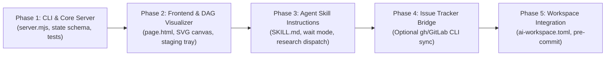

# Specification: `wayfinder-ui` Skill

**Version:** 1.0.0-draft  
**Target Directory:** [`repositories/wayfinder-ui`](file:///home/mezmo/Work/vibe/agent-skills/repositories/wayfinder-ui)  
**Reference Implementations:** [`repositories/grill-with-ui`](file:///home/mezmo/Work/vibe/agent-skills/repositories/grill-with-ui), [`.agents/skills/wayfinder`](file:///home/mezmo/Work/vibe/agent-skills/.agents/skills/wayfinder)

---

## 1. Executive Summary & Vision

### 1.1 What is Wayfinder?
[`wayfinder`](file:///home/mezmo/Work/vibe/agent-skills/.agents/skills/wayfinder/SKILL.md) is an agent skill designed for massive, ambiguous software planning efforts that exceed what a single agent context window can hold. Rather than rushing blindly into execution, Wayfinder charts a structured map of **decision tickets** (questions whose answers resolve architectural fork-in-the-road decisions rather than code slices) on an issue tracker, and walks the **frontier** (unblocked, open decisions) one ticket at a time until the route to the Destination is crystal clear.

### 1.2 The Problem with Terminal & Issue-Tracker Wayfinding
In its current incarnation, `wayfinder` has significant ergonomic and cognitive friction:
1. **Loss of Spatial & Graph Context:** In terminal chat, users cannot visualize the decision DAG (Directed Acyclic Graph), the dependencies between tickets, or where the "frontier" currently stands relative to the "fog of war".
2. **Context Bloat:** Discussing tickets and inspecting research across terminal turns pollutes the agent's context window.
3. **Fragmented Issue Tracker Interaction:** Creating, editing, and wiring blocking dependencies across GitHub/GitLab issues requires dozens of CLI calls (`gh issue create`, `gh api ... dependencies`) that slow down human-agent collaboration.
4. **All-or-Nothing Interactivity:** A user cannot easily stage multiple thoughts, review a ticket's alternatives, defer a decision, or trigger parallel research while staying in the flow of reviewing the overall map.

### 1.3 The Solution: `wayfinder-ui`
`wayfinder-ui` ports the mechanics of `wayfinder` into the local-browser architecture established by [`grill-with-ui`](file:///home/mezmo/Work/vibe/agent-skills/repositories/grill-with-ui):
- **Local Browser Workspace:** An ultra-lightweight Node.js web server hosts an interactive, zero-build dashboard on `localhost`.
- **Interactive Visual Map & Frontier DAG:** An interactive graph visualizes the Destination, Resolved Decisions, Frontier Tickets (unblocked and actionable), Blocked Tickets, and the Fog of War.
- **Card-Based Decision Staging:** Users inspect ticket options, review recommendations, carry out ticket-specific discussion threads, or graduate fog into new tickets. Everything is staged locally in the browser until an explicit **Send to Agent** (⌘↩) action.
- **Split-Ownership Data Protocol:** Agent owns `state.json` (modified solely via token-efficient atomic patches); browser appends user actions to `events.jsonl`.
- **Dual Runtime Support:** Seamless operation under Claude Code's persistent `Monitor` tool as well as universal foreground `wait` mode for Gemini CLI, Codex, Cursor, and GitHub Copilot.
- **Hybrid Storage:** Capable of running 100% locally with zero external dependencies, or bi-directionally syncing tickets with GitHub Issues via `gh`.

---

## 2. Deep Dive: How `grill-with-ui` Works

[`grill-with-ui`](file:///home/mezmo/Work/vibe/agent-skills/repositories/grill-with-ui) achieves high performance, multi-agent compatibility, and extreme token frugality through several core design patterns:

### 2.1 Split Ownership & IPC Architecture
```
┌─────────────────────────────────────────────────────────────┐
│                      Browser Web App                        │
│             (Vanilla HTML/CSS/JS, Polling /state)            │
└──────────────┬──────────────────────────────▲───────────────┘
               │ POST /send                   │ GET /state
               ▼                              │
┌─────────────────────────────────────────────────────────────┐
│                 Node Server (server.mjs)                     │
│       Serves page.html, validates Origin, stamps times      │
└──────────────┬──────────────────────────────┬───────────────┘
               │ Appends                      │ Reads
               ▼                              │
┌──────────────────────────────┐ ┌────────────────────────────┐
│         events.jsonl         │ │         state.json         │
│  (Browser-owned append log)  │ │   (Agent-owned state doc)  │
└──────────────┬───────────────┘ └────────────▲───────────────┘
               │                              │
               │ stdout / wait                │ node server.mjs patch
               ▼                              │
┌─────────────────────────────────────────────────────────────┐
│                      AI Coding Agent                        │
│            (Claude Code Monitor OR Wait-Mode Loop)          │
└─────────────────────────────────────────────────────────────┘
```

1. **Strict File Ownership:**
   - `state.json` is written **only by the agent**. The agent never writes directly with raw file tools; it uses `node server.mjs patch`.
   - `events.jsonl` is written **only by the server** when the browser posts a `/send` action batch.
   - Because writers never cross boundaries, no file locks or race conditions occur.
2. **Atomic In-Memory Patching (`node server.mjs patch`):**
   - In a long session, `state.json` grows to 50KB–100KB+. If an agent had to read and rewrite the entire file on each turn, thousands of tokens would be burned every send.
   - Instead, the agent emits a minimal JSON patch (specifying only changed fields or new questions). The CLI merges the patch, validates the full schema, stamps missing ISO timestamps, and performs an atomic rename via a temporary PID file.
   - The CLI responds with a tiny status line (`{"ok":true,"questions":12,"open":3,"handled":14,"bytes":41233}`), keeping the agent's context clean.
3. **Dual Listening Mechanism:**
   - **Persistent Monitor Mode:** When supported by the harness (e.g. Claude Code), `server.mjs serve` is run as a persistent command. Whenever a send occurs, `server.mjs` logs the event line to `stdout`, waking the agent turn.
   - **Wait Mode Loop:** When run in agents lacking persistent stdout monitors (Codex, Gemini CLI, Cursor), the server runs detached (`nohup ... &`), and the agent maintains a foreground blocking loop using `node server.mjs wait --session <dir> --after <handled> --timeout 480`. When a send arrives, `wait` prints the event and exits with code 0, allowing the agent to handle the turn and re-enter the loop.
4. **Background Subagent Delegation (Visualize):**
   - For generating prototypes or architecture diagrams, the orchestrating agent **never writes the HTML inline**.
   - Instead, it dispatches a background subagent with a concise brief ([`visual-brief.md`](file:///home/mezmo/Work/vibe/agent-skills/repositories/grill-with-ui/visual-brief.md)), noting the file mtime.
   - The subagent writes directly to `<session>/visual.html`. When done, the orchestrating agent bumps `visual.version` in `state.json`. The browser reloads the sandboxed iframe without interrupting ongoing user conversation.

---

## 3. Structural Comparison: `grill-with-ui` vs. `wayfinder-ui`

| Dimension | `grill-with-ui` | `wayfinder-ui` |
| :--- | :--- | :--- |
| **Primary Goal** | Deepen, clarify, and stress-test a single design topic via rounds of questions. | Map, structure, and incrementally clear the fog on a multi-session epic via decision tickets. |
| **Data Hierarchy** | Topic $\rightarrow$ Linear Rounds $\rightarrow$ Questions ($q_1, q_2 \dots$). | Destination $\rightarrow$ Map $\rightarrow$ Ticket DAG + Fog of War + Out of Scope. |
| **Node Graph Structure** | Implicit prerequisite tree (`deps: ["q1"]`), rendered as a flat list grouped by round. | Explicit Directed Acyclic Graph (DAG) with native blocking edges (`blocked_by` / `blocks`). |
| **Node Types** | Homogeneous questions (with options, body, rec, explore). | Heterogeneous tickets: `grilling` (HITL), `prototype` (HITL), `research` (AFK subagent), `task` (HITL/AFK). |
| **Dynamic Frontier** | Open questions in the current round. | Unblocked, open, unclaimed tickets whose prerequisites are all closed. |
| **Uncertainty Buffer** | Deferred questions. | **Fog of War** ("Not yet specified" loosely bounded conceptual areas that graduate into tickets). |
| **Artifact Output** | Exhaustive topic design doc (`docs/<topic>-design.md`) + `visual.html`. | Map roadmap document (`docs/<epic>-roadmap.md`), resolved ADRs, research notes, and synchronized tracker issues. |
| **External Integrations** | None (self-contained under `~/.grill-with-ui`). | Dual mode: Local-first (`~/.wayfinder-ui`) with optional GitHub Issues (`gh`) sync. |

---

## 4. `wayfinder-ui` Architecture & Data Models

### 4.1 Storage & Session Directory Layout
Following the project key convention from `grill-with-ui`, session state is stored in the user's home directory to avoid polluting git working copies:
```
~/.wayfinder-ui/sessions/<project-key>/<YYYYMMDD-HHMMSS>/
├── state.json          # Agent-managed state: Destination, Map DAG, Tickets, Fog, Decisions
├── events.jsonl        # Client-managed append log of user actions/sends
├── server.json         # Runtime daemon info: { url, port, pid, started }
├── visual.html         # Optional subagent-rendered roadmap/architecture prototype
├── research/           # Cached outputs from AFK research subagents
│   └── t2-auth-eval.md
└── serve.log           # Output log when running server detached in wait mode
```

`<project-key>` is resolved via git common root (`git rev-parse --path-format=absolute --git-common-dir`) so all worktrees of a repository share the same wayfinding sessions.

### 4.2 `state.json` Schema
```jsonc
{
  "destination": "Deliver zero-downtime database sharding for analytics events",
  "notes": "PostgreSQL 16, Citus extension; must consult skills 'domain-modeling' and 'tdd'",
  "project": "/home/user/work/my-project",
  "created": "2026-09-21T18:00:00.000Z",
  "tracker": {
    "type": "local", // "local" | "github" | "gitlab"
    "map_id": "issue-102",
    "map_url": "https://github.com/org/repo/issues/102"
  },
  "agent": {
    "status": "waiting", // "waiting" | "working"
    "since": "2026-09-21T18:05:00.000Z",
    "handled": 4
  },
  "active_ticket_id": "t2", // Currently selected or claimed ticket
  "tickets": [
    {
      "id": "t1",
      "title": "Evaluate Citus vs Native Declarative Partitioning",
      "type": "research", // "research" | "prototype" | "grilling" | "task"
      "status": "resolved", // "frontier" | "blocked" | "in_progress" | "resolved" | "out_of_scope"
      "assignee": "@agent",
      "blocked_by": [],
      "blocks": ["t2", "t3"],
      "question": "Which sharding mechanism meets our 50k writes/sec requirement without introducing external coordinators?",
      "answer": {
        "summary": "Native declarative range partitioning with pg_partman meets performance without foreign data wrappers.",
        "resolved_at": "2026-09-21T18:10:00.000Z",
        "asset_url": "research/t1-partitioning.md"
      },
      "thread": [
        { "who": "agent", "text": "Research subagent completed benchmarking.", "at": "2026-09-21T18:08:00.000Z" }
      ]
    },
    {
      "id": "t2",
      "title": "Tenant Isolation vs Shared Tables",
      "type": "grilling",
      "status": "frontier", // Unblocked because t1 is resolved!
      "assignee": "@me",
      "blocked_by": ["t1"],
      "blocks": ["t4"],
      "question": "Should enterprise tenants occupy dedicated partition schemas or share rows with a tenant_id composite key?",
      "options": [
        { "k": "A", "text": "Dedicated schema per tenant (strict isolation, higher migration complexity)" },
        { "k": "B", "text": "Shared partitioned tables by hash(tenant_id) (uniform maintenance, row-level security)" }
      ],
      "rec": {
        "option": "B",
        "why": "Tenant count is projected to exceed 5,000; individual schemas would exceed Postgres catalog memory limits."
      },
      "thread": []
    }
  ],
  "fog": [
    {
      "id": "fog-1",
      "title": "Cross-shard analytical query rollup",
      "area": "Reporting pipeline",
      "notes": "We know aggregations will be slow if shards reside on distinct disks, but we cannot specify queries until table schemas in t2/t4 settle."
    }
  ],
  "out_of_scope": [
    {
      "id": "t0",
      "title": "Migrating legacy billing tables",
      "why": "Billing data remains on Aurora MySQL; only telemetry/event analytics are moving."
    }
  ],
  "terms": [
    { "term": "Frontier", "def": "Open, unblocked tickets ready for decision.", "avoid": ["backlog", "queue"] },
    { "term": "Fog of War", "def": "In-scope decisions that cannot yet be specified.", "avoid": ["icebox", "backlog"] }
  ],
  "finished": null
}
```

### 4.3 `events.jsonl` Action Payloads
Every browser interaction batch sent via `POST /send` produces an event entry:
```jsonc
{
  "type": "send",
  "seq": 5,
  "at": "2026-09-21T18:15:00.000Z",
  "session": "/home/user/.wayfinder-ui/sessions/.../...",
  "actions": [
    {
      "type": "claim_ticket",
      "ticket_id": "t2"
    },
    {
      "type": "answer_ticket",
      "ticket_id": "t2",
      "kind": "option", // "option" | "accept" | "text"
      "option": "B",
      "rationale": "We agree catalog table bloat is unacceptable."
    },
    {
      "type": "thread_message",
      "ticket_id": "t2",
      "text": "What does this imply for backup/restore per tenant?"
    },
    {
      "type": "graduate_fog",
      "fog_id": "fog-1",
      "new_ticket": {
        "title": "Read-replica fanout strategy for analytics rollups",
        "type": "research",
        "blocked_by": ["t2"]
      }
    }
  ]
}
```

---

## 5. UI/UX Interface Design (`page.html`)

The user interface follows the responsive three-column layout of `grill-with-ui`, but customizes the panels specifically for Map & DAG Wayfinding.

```
┌────────────────────────────────────────────────────────────────────────────────────────┐
│ [● Waiting] Wayfinder: Database Sharding Architecture            [Visualize] [Finish]  │
├──────────────┬──────────────────────────────────────────┬──────────────────────────────┤
│ MAP INDEX    │ MAIN VIEWPORT: INTERACTIVE DAG / CARD    │ TICKET DISCUSSION & STAGING  │
│              │                                          │                              │
│ Destination: │  [Destination: Sharding Architecture]    │ Thread: Ticket #t2           │
│ "Deliver..." │                      │                   │                              │
│              │             ┌────────▼────────┐          │ User: What about backups?    │
│ FRONTIER (1) │             │ t1: Citus vs... │          │                              │
│ ▸ t2 Tenant  │             │   [Resolved]    │          │ Agent: Backups run on the... │
│              │             └────────┬────────┘          │                              │
│ BLOCKED (1)  │                      │                   ├──────────────────────────────┤
│ ◽ t4 Query  │             ┌────────▼────────┐          │ STAGED ACTIONS (2)           │
│              │             │  t2: Tenant ISO │ ◄ ACTIVE │ ✓ Answer t2 -> Option B      │
│ FOG (1)      │             │   [Frontier]    │          │ ✚ Graduate fog-1 to t5       │
│ ☁ Cross-shard│             └────────┬────────┘          │                              │
│              │                      │                   │                              │
│ OUT OF SCOPE │             ┌────────▼────────┐          │ [ Send 2 Actions (⌘↩) ]      │
│ ✕ Legacy bill│             │  (Fog of War)   │          │                              │
│              │             └─────────────────┘          │                              │
└──────────────┴──────────────────────────────────────────┴──────────────────────────────┘
```

### 5.1 Left Column: Map Navigator & Tree
- **Destination Header:** Shows the north star.
- **Frontier Filter:** Highlights actionable, unblocked tickets ready for immediate resolution.
- **Blocked Tickets:** Clearly indicates dependencies preventing work on downstream items.
- **Fog of War Area:** Quick-add button to jot down loose concepts that aren't yet ticketable.
- **Decisions So Far / Out of Scope:** Filterable list of locked decisions with 1-line gists.

### 5.2 Center Column: Dual-Mode Interactive Canvas
Users can switch between two views:
1. **Interactive DAG Map View:**
   - Visual topology showing nodes connected by dependency edges.
   - Node styling:
     - **Resolved:** Muted green outline with checkmark.
     - **Frontier:** Glowing amber/green border with pulsing beacon.
     - **Blocked:** Dim outline with lock icon, listing open blocker IDs.
     - **Fog of War:** Cloud-shaped dashed cards hovering at the edge of the known frontier.
   - Click-to-focus: Clicking any node highlights its dependency path and loads its ticket card.
2. **Ticket Detail Card View:**
   - Ticket type badge: `Research (AFK)`, `Prototype (HITL)`, `Grilling (HITL)`, or `Task (HITL/AFK)`.
   - The Decision Question & Options.
   - Highlighted Recommendation with "Why" trade-off rationale.
   - Embedded artifact viewer (e.g. Markdown renderer for research reports, or sandboxed iframe for UI prototypes).
   - "Claim", "Accept", "Defer", or "Rule Out of Scope" action buttons.

### 5.3 Right Column: Thread & Staging Tray
- **Contextual Thread:** Chat history for the selected ticket or fog item.
- **Action Staging Area:**
  - Displays all pending modifications staged in local storage.
  - Allows reverting or modifying actions before submission.
  - Prominent **"Send N Actions to Agent"** button (bound to `Cmd+Enter` / `Ctrl+Enter`).

---

## 6. Implementation Plan for `repositories/wayfinder-ui`

The new skill will be placed in `repositories/wayfinder-ui` as a standalone git repository (submodule), following the standard Agent Skills specification.

### 6.1 Target File Hierarchy
```
repositories/wayfinder-ui/
├── SKILL.md                 # Full agent instructions, lifecycle, schema, wait/monitor rules
├── server.mjs               # Node.js server, CLI commands, patch validation, wait loops
├── page.html                # Unified HTML/CSS/JS frontend with SVG DAG renderer
├── README.md                # Installation and usage instructions for humans
├── visual-brief.md          # Subagent instructions for drawing roadmap/architecture visual.html
├── test/
│   ├── server.test.mjs      # Comprehensive tests for CLI, patching, wait, and DAG integrity
│   └── page.e2e.mjs         # Headless browser tests for graph rendering and staging
├── docs/
│   └── design.md            # Architectural decisions and vocabulary
└── LICENSE                  # Open source license
```

### 6.2 Phased Development Schedule



#### Phase 1: Core Daemon & Patch Engine (`server.mjs`)
1. **Subcommands Implementation:**
   - `new --destination "<goal>" [--notes "..."] [--tracker local|github]`: initializes session folder, `state.json`, and blank `events.jsonl`.
   - `serve --session <dir> [--port <n>]`: serves `page.html`, `/state`, `/events`, `/send`, `/visual`, and prints ready notification.
   - `patch --session <dir> [--file <p>]`: atomic merger for `destination`, `tickets`, `fog`, `out_of_scope`, `agent`, and missing timestamp auto-fill.
   - `wait --session <dir> [--after <seq>] [--timeout <s>]`: foreground blocking listener for non-monitor AI agents.
   - `pending --session <dir>` & `sessions [--all]`: session discovery and resume replay.
2. **DAG Validation Engine:**
   - Guarantee cycle detection on `blocked_by` / `blocks` references.
   - Validate automatic frontier calculation (a ticket is in `status: "frontier"` if and only if all IDs in `blocked_by` are `status: "resolved"`).
3. **Unit Tests:**
   - Comprehensive test suite in `test/server.test.mjs` executing via `node --test`.

#### Phase 2: Interactive Frontend (`page.html`)
1. **Lightweight DAG Visualization Engine:**
   - Built with pure SVG and vanilla JavaScript (no npm, no Webpack/Vite).
   - Topological layout algorithm calculating rank layers (columns/rows) from root dependencies to the Destination.
   - Interactive zoom/pan or responsive auto-fitting.
2. **Staging & State Reconciliation:**
   - Real-time polling of `/state` every 1000ms.
   - Staging engine surviving browser reloads (cached in `sessionStorage` or local state diff).
   - Origin security checking to protect against cross-site request forgery.

#### Phase 3: Agent Prompt & Execution Protocol (`SKILL.md`)
1. **Dual Invocation Flow:**
   - **Mode A: Chart the Map:** Initial interview to set Destination, establish frontier questions, identify fog of war, and populate round 1 tickets.
   - **Mode B: Work the Map:** Load map, select frontier ticket, resolve decision, graduate fog, and append context pointers to Decisions So Far.
2. **Background Subagent Delegation:**
   - Automatic dispatch of `research` tickets using subagents.
   - Subagent output capture directly into `<session>/research/<ticket-id>.md`.
   - Roadmap / Architecture visual generation via `visual-brief.md`.
3. **Wait Mode Protocol:**
   - Strict loop definitions ensuring non-monitor harnesses (Gemini CLI, Cursor, Copilot) do not prematurely terminate turns while waiting for browser input.

#### Phase 4: Issue Tracker Bridge (Optional Synchronization)
1. **Local-First Default:**
   - Zero configuration required; operates out of `~/.wayfinder-ui/sessions/`.
2. **GitHub/GitLab CLI Adapter:**
   - When `--tracker github` is passed, `server.mjs sync` or the agent can optionally reflect the canonical map as an issue labeled `wayfinder:map` and tickets as sub-issues.
   - Local state remains the high-speed cache and UI interface; tracker provides remote persistence for distributed team visibility.

#### Phase 5: Workspace Registration & Testing
1. **Submodule Registration:**
   - Initialized in `repositories/wayfinder-ui` and declared in `.gitmodules`.
2. **Symlink Distribution:**
   - Registered in `ai-workspace.toml` under `distribution.skills_paths` so that `.agents/skills/wayfinder-ui` and `.claude/skills/wayfinder-ui` are automatically maintained.
3. **End-to-End Validation:**
   - Run Playwright E2E browser tests and pre-commit checks (`uv run pre-commit run --all-files`).

---

## 7. Key Trade-Offs & Decisions

1. **Zero External Runtime Dependencies:**
   - *Decision:* Build `server.mjs` using pure `node:http`, `node:fs`, `node:child_process` and `page.html` with vanilla SVG/CSS/JS.
   - *Rationale:* Eliminates `node_modules`, npm install failures, and bundler compilation friction across developer environments.
2. **Split-File IPC vs. WebSockets:**
   - *Decision:* Rely on polling `GET /state` and `POST /send` over HTTP with file-backed `state.json` and `events.jsonl`.
   - *Rationale:* Files survive browser crashes, agent timeouts, and machine reboots. Agents can resume conversations effortlessly by inspecting `pending` events.
3. **SVG DAG Layout vs. Third-Party Canvas (e.g. Cytoscape / D3):**
   - *Decision:* Implement a clean, native topological layering algorithm (modified Sugiyama approach) directly in ~250 lines of vanilla JavaScript.
   - *Rationale:* Keeps `page.html` fully self-contained, auditable, and light (<60KB total).
4. **Decisions Over Deliverables:**
   - *Decision:* Preserve the core Wayfinder philosophy: tickets resolve architectural and design questions, not code implementations.
   - *Rationale:* Prevents the agent from wandering off into multi-thousand-line coding rabbit holes before the route to the Destination has been agreed upon.
